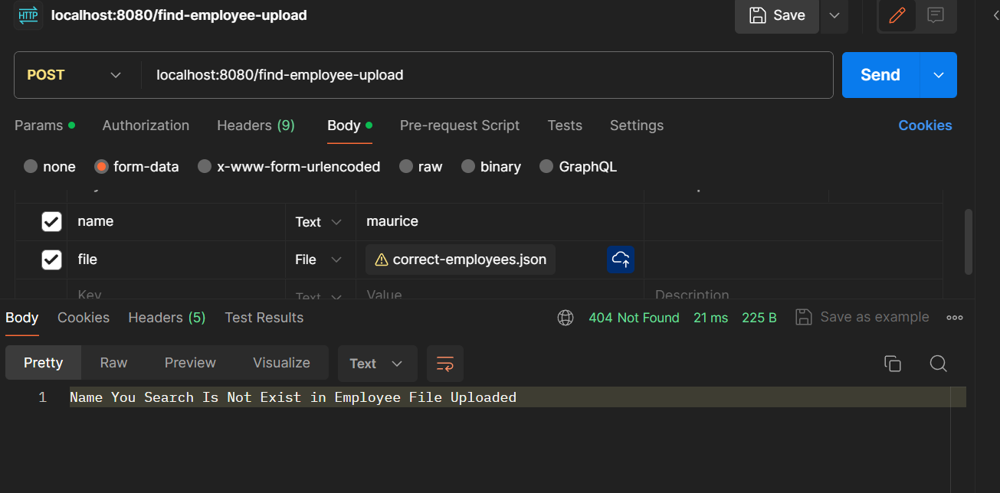

# Evidence Care Employee (Woka)

## System Requirements

- Java OpenJdk version 17
- Docker Desktop
- Postman

## API Endpoint

- POST "/find-employee-upload"
  form-data:
  name: "evelina,eveleene"
  file: choose file json (Ex: correct-employees.json)

## How To Run App

1. git clone https://github.com/
2. cd /evidence-care/woka/
3. Open terminal
4. run command
```bash

docker build -t evidence-care-woka-image .  

```

5. run command
```bash
docker run -p 8080:8080 evidence-care-woka-image  
```

6. Open Postman
   request POST , choose "body" and "form-data"

## Response

```bash
[
    {
        "id": "10",
        "name": "evelina",
        "manager": {
            "id": "9",
            "name": "eveleen",
            "manager": {
                "id": "3",
                "name": "kacie",
                "manager": {
                    "id": "1",
                    "name": "raelynn",
                    "manager": null,
                    "directReport": 0,
                    "indirectReport": 0
                },
                "directReport": 1,
                "indirectReport": 0
            },
            "directReport": 1,
            "indirectReport": 1
        },
        "directReport": 1,
        "indirectReport": 2
    }
]
```

## Stop The App
1. Open new terminal run command :
```bash
   docker ps
```
2. Find container id 
3. Run command
```bash
   docker stop <container_id>
```

## Contributing

Pull requests are welcome. For major changes, please open an issue first
to discuss what you would like to change.

Please make sure to update tests as appropriate.
Created by Woka Aditama @2024